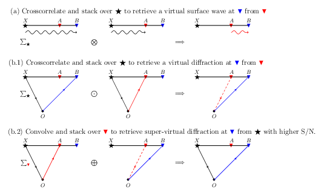

- [Main content](ch3_main.md)
- [Prev figure](ch3_fig01.md)
- [Next figure](ch3_fig03.md)

.    
**Figure 2:** (a) The step for retrieving dominant surface waves between two receivers by SI. (b1), (b2) The steps for creating super-virtual diffractions with an increased signal-to-noise ratio (S/N). Note that the surface-wave component can also be retrieved/enhanced by the SVI step. Hence, it is beneficial to apply SVI for diffraction enhancement only after suppression of the dominant surface waves. $\bigotimes$, $\bigodot$, $\bigoplus$ denote crosscorrelation-, crosscoherence-, and crossconvolution-based operators, respectively. $\leadsto$ represents surface waves propagating along the surface from an active source to the receivers. $\to$ denotes the propagation of diffracted waves from an active source to the receivers. 

<span style="color:black"> **Source code used to reproduce Figure 2**: </span> <br>
<span style="color:blue"> *Dependency:* </span> [Tikz](https://www.overleaf.com/learn/latex/TikZ_package). <br>
<span style="color:blue"> *Data availability:* </span> No input data is needed.

```tex

% Schemes for SI & SVI
% Author: Jianhuan Liu
% 20-01-2020

\documentclass[tikz,border=10pt]{standalone}
%%%<
\usepackage{amssymb}
\usepackage{verbatim}
\usepackage{xcolor}

%%%>

\usepackage{tikz}
\usetikzlibrary{arrows,shapes,positioning}
\usetikzlibrary{decorations.markings}
\tikzstyle arrowstyle=[scale=1]
\usetikzlibrary{patterns,arrows,calc,decorations.pathmorphing}
\tikzstyle directed=[postaction={decorate,decoration={markings,
    mark=at position .65 with {\arrow[arrowstyle]{stealth}}}}]
\tikzstyle reverse directed=[postaction={decorate,decoration={markings,
    mark=at position .65 with {\arrowreversed[arrowstyle]{stealth};}}}]
    
% Modified \textcircled macro
\renewcommand*\textcircled[1]{\tikz[baseline=(char.base)]{
  \node [shape=circle,draw,inner sep=1pt] (char) {#1};}}

\begin{document}
\begin{tikzpicture}[scale=2.0]
    % variables for pn-junction diagram:
    % all parameters are in tikz scale
    % p-side of the junction is here on the right
%\draw[step=1cm,gray,very thin] (0,0) grid (9,6);

\def\Ax{0.5}, \def\Ay{1.5}
\def\Bx{1.5}, \def\By{1.5}
\def\Cx{2}, \def\Cy{1.5}
\def\Dx{1}, \def\Dy{0.5}
\def\StepX{2.5}, \def\StepY{2}
\def\Shift{0.15}

% ----> Step (1) <----
% define cooridinates
\coordinate (A) at (\Ax,\Ay);
\coordinate (B) at (\Bx,\By);
\coordinate (C) at (\Cx,\Cy);
\coordinate (D) at (\Dx,\Dy);


% nodes at each point
\draw (A) node {$\bigstar$};
\draw (B) node {\color{red}$\blacktriangledown$};
\draw (C) node {\color{blue}$\blacktriangledown$};
\draw (D) node {$\bullet$};

% add comments at each nodes, suggested by Deyan
\draw (\Ax, \Ay+\Shift) node{\small $X$};
\draw (\Bx, \By+\Shift) node{\small $A$};
\draw (\Cx, \Cy+\Shift) node{\small $B$};
\draw (\Dx, \Dy-\Shift) node{\small $O$};

%\draw (\Ax,\Dy) node {$\sum_{\bigstar}$};
\draw (\Ax,0.5*\Ay+0.5*\Dy) node {$\sum_{\color{red}\blacktriangledown}$};

\draw (0.5+\Cx, 0.5*\Ay+0.5*\Dy) node {$\bigoplus$};
\draw (\Ax+3.98,\Ay+0.4) node {\large (b.2) Convolve and stack over $\color{red}\blacktriangledown$ to retrieve super-virtual diffraction at \color{blue}$\blacktriangledown$ \color{black} from $\bigstar$ with higher S/N.};

% connect each nodes
\draw [thick](A) -- (C);
\draw[black,directed] (A) -- (D);
\draw[red,directed] (D) -- (B);

% ----> Step (2) <----
% new coordinates
\pgfmathsetmacro\Ax{\Ax+\StepX}
\pgfmathsetmacro\Bx{\Bx+\StepX}
\pgfmathsetmacro\Cx{\Cx+\StepX}
\pgfmathsetmacro\Dx{\Dx+\StepX}

% define cooridinates
\coordinate (A) at (\Ax,\Ay);
\coordinate (B) at (\Bx,\By);
\coordinate (C) at (\Cx,\Cy);
\coordinate (D) at (\Dx,\Dy);

% nodes at each point
\draw (A) node {$\bigstar$};
\draw (B) node {\color{red}$\blacktriangledown$};
\draw (C) node {\color{blue}$\blacktriangledown$};
\draw (D) node {$\bullet$};

% add comments at each nodes, suggested by Deyan
\draw (\Ax, \Ay+\Shift) node{\small $X$};
\draw (\Bx, \By+\Shift) node{\small $A$};
\draw (\Cx, \Cy+\Shift) node{\small $B$};
\draw (\Dx, \Dy-\Shift) node{\small $O$};

\draw (0.5+\Cx, 0.5*\Ay+0.5*\Dy) node {$\Longrightarrow$};

% connect each nodes
\draw [thick] (A) -- (C);
\draw[red,dashed,directed] (B) -- (D);
\draw[blue,directed] (D) -- (C);

% ----> Step (3) <----
% new coordinates
\pgfmathsetmacro\Ax{\Ax+\StepX}
\pgfmathsetmacro\Bx{\Bx+\StepX}
\pgfmathsetmacro\Cx{\Cx+\StepX}
\pgfmathsetmacro\Dx{\Dx+\StepX}

% define cooridinates
\coordinate (A) at (\Ax,\Ay);
\coordinate (B) at (\Bx,\By);
\coordinate (C) at (\Cx,\Cy);
\coordinate (D) at (\Dx,\Dy);

% nodes at each point
\draw (A) node {$\bigstar$};
\draw (B) node {\color{red}$\blacktriangledown$};
\draw (C) node {\color{blue}$\blacktriangledown$};
\draw (D) node {$\bullet$};

% add comments at each nodes, suggested by Deyan
\draw (\Ax, \Ay+\Shift) node{\small $X$};
\draw (\Bx, \By+\Shift) node{\small $A$};
\draw (\Cx, \Cy+\Shift) node{\small $B$};
\draw (\Dx, \Dy-\Shift) node{\small $O$};

% connect each nodes
\draw [thick] (A) -- (C);
\draw[black,directed] (A) -- (D);
\draw[blue,directed] (D) -- (C);


% ----> Step (4) <----
% reset coordinates
\def\Ax{0.5}, \def\Ay{1.5}
\def\Bx{1.5}, \def\By{1.5}
\def\Cx{2}, \def\Cy{1.5}
\def\Dx{1}, \def\Dy{0.5}
\def\StepX{2.5}, \def\StepY{2}

% new coordinates
\pgfmathsetmacro\Ay{\Ay+\StepY}
\pgfmathsetmacro\By{\By+\StepY}
\pgfmathsetmacro\Cy{\Cy+\StepY}
\pgfmathsetmacro\Dy{\Dy+\StepY}

% define cooridinates
\coordinate (A) at (\Ax,\Ay);
\coordinate (B) at (\Bx,\By);
\coordinate (C) at (\Cx,\Cy);
\coordinate (D) at (\Dx,\Dy);
% nodes at each point
\draw (A) node {$\bigstar$};
\draw (B) node {\color{red}$\blacktriangledown$};
\draw (C) node {\color{blue}$\blacktriangledown$};
\draw (D) node {$\bullet$};

% add comments at each nodes, suggested by Deyan
\draw (\Ax, \Ay+\Shift) node{\small $X$};
\draw (\Bx, \By+\Shift) node{\small $A$};
\draw (\Cx, \Cy+\Shift) node{\small $B$};
\draw (\Dx, \Dy-\Shift) node{\small $O$};

\draw (\Ax,0.5*\Ay+0.5*\Dy) node {$\sum_\bigstar$};
\draw (0.5+\Cx, 0.5*\Ay+0.5*\Dy) node {$\bigodot$};
\draw (\Ax+3.23,\Ay+0.4) node {\large (b.1) Crosscorrelate and stack over $\bigstar$ to retrieve a virtual diffraction at \color{blue}$\blacktriangledown$ \color{black} from \color{red}$\blacktriangledown$};

% connect each nodes
\draw [thick] (A) -- (C);
\draw[black,directed] (A) -- (D);
\draw[blue,directed] (D) -- (C);

% ----> Step (5) <----
% reset coordinates
\pgfmathsetmacro\Ax{\Ax+\StepX}
\pgfmathsetmacro\Bx{\Bx+\StepX}
\pgfmathsetmacro\Cx{\Cx+\StepX}
\pgfmathsetmacro\Dx{\Dx+\StepX}

% define cooridinates
\coordinate (A) at (\Ax,\Ay);
\coordinate (B) at (\Bx,\By);
\coordinate (C) at (\Cx,\Cy);
\coordinate (D) at (\Dx,\Dy);
% nodes at each point
\draw (A) node {$\bigstar$};
\draw (B) node {\color{red}$\blacktriangledown$};
\draw (C) node {\color{blue}$\blacktriangledown$};
\draw (D) node {$\bullet$};
\draw (0.5+\Cx, 0.5*\Ay+0.5*\Dy) node {$\Longrightarrow$};

% add comments at each nodes, suggested by Deyan
\draw (\Ax, \Ay+\Shift) node{\small $X$};
\draw (\Bx, \By+\Shift) node{\small $A$};
\draw (\Cx, \Cy+\Shift) node{\small $B$};
\draw (\Dx, \Dy-\Shift) node{\small $O$};

% connect each nodes
\draw [thick] (A) -- (C);
\draw[black,directed] (A) -- (D);
\draw[red,directed] (D) -- (B);


% ----> Step (6) <----
% reset coordinates
\pgfmathsetmacro\Ax{\Ax+\StepX}
\pgfmathsetmacro\Bx{\Bx+\StepX}
\pgfmathsetmacro\Cx{\Cx+\StepX}
\pgfmathsetmacro\Dx{\Dx+\StepX}

% define cooridinates
\coordinate (A) at (\Ax,\Ay);
\coordinate (B) at (\Bx,\By);
\coordinate (C) at (\Cx,\Cy);
\coordinate (D) at (\Dx,\Dy);
% nodes at each point
\draw (A) node {$\bigstar$};
\draw (B) node {\color{red}$\blacktriangledown$};
\draw (C) node {\color{blue}$\blacktriangledown$};
\draw (D) node {$\bullet$};

% add comments at each nodes, suggested by Deyan
\draw (\Ax, \Ay+\Shift) node{\small $X$};
\draw (\Bx, \By+\Shift) node{\small $A$};
\draw (\Cx, \Cy+\Shift) node{\small $B$};
\draw (\Dx, \Dy-\Shift) node{\small $O$};

% connect each nodes
% connect each nodes
\draw [thick](A) -- (C);
\draw[red,dashed,directed] (B) -- (D);
\draw[blue,directed] (D) -- (C);

% ----> Step (7) <----
% reset coordinates
\def\Ax{0.5}, \def\Ay{1.5}
\def\Bx{1.5}, \def\By{1.5}
\def\Cx{2}, \def\Cy{1.5}
\def\Dx{1}, \def\Dy{0.5}
\def\StepX{2.5}, \def\StepY{2}

% new coordinates
\pgfmathsetmacro\Ay{\Ay+\StepY+\StepY-0.5}
\pgfmathsetmacro\By{\By+\StepY+\StepY-0.5}
\pgfmathsetmacro\Cy{\Cy+\StepY+\StepY-0.5}
\pgfmathsetmacro\Dy{\Dy+\StepY+\StepY-0.5}

% define cooridinates
\coordinate (A) at (\Ax,\Ay);
\coordinate (B) at (\Bx,\By);
\coordinate (C) at (\Cx,\Cy);
\coordinate (D) at (\Dx,\Dy);
% nodes at each point
\draw (A) node {$\bigstar$};
\draw (B) node {\color{red}$\blacktriangledown$};
\draw (C) node {\color{blue}$\blacktriangledown$};

% add comments at each nodes, suggested by Deyan
\draw (\Ax, \Ay+\Shift) node{\small $X$};
\draw (\Bx, \By+\Shift) node{\small $A$};
\draw (\Cx, \Cy+\Shift) node{\small $B$};


\draw (\Ax,0.5*\Ay+0.5*\Dy) node {$\sum_{\bigstar}$};
\draw (0.5+\Cx, 0.5*\Ay+0.5*\Dy) node {$\bigotimes$};

\draw (\Ax+3.3,\Ay+0.4) node {\large (a) Crosscorrelate and stack over $\bigstar$ to retrieve a virtual surface wave at \color{blue}$\blacktriangledown$ \color{black} from \color{red}$\blacktriangledown$ };

\def\Vy{-0.2}
% connect each nodes
\draw [black,decorate, decoration={snake,amplitude=1.0mm, segment length=5mm},->] (\Ax, \Vy+\Ay) -- (\Cx, \Vy+\Cy);
\draw [thick] (A) -- (C);
%\draw[black,thick,directed] (A) -- (D);
%\draw[red,directed,thick] (D) -- (B);

% ----> Step (8) <----
% reset coordinates
\pgfmathsetmacro\Ax{\Ax+\StepX}
\pgfmathsetmacro\Bx{\Bx+\StepX}
\pgfmathsetmacro\Cx{\Cx+\StepX}
\pgfmathsetmacro\Dx{\Dx+\StepX}

% define cooridinates
\coordinate (A) at (\Ax,\Ay);
\coordinate (B) at (\Bx,\By);
\coordinate (C) at (\Cx,\Cy);
\coordinate (D) at (\Dx,\Dy);
% nodes at each point
\draw (A) node {$\bigstar$};
\draw (B) node {\color{red}$\blacktriangledown$};
\draw (C) node {\color{blue}$\blacktriangledown$};
\draw (0.5+\Cx, 0.5*\Ay+0.5*\Dy) node {$\Longrightarrow$};

% add comments at each nodes, suggested by Deyan
\draw (\Ax, \Ay+\Shift) node{\small $X$};
\draw (\Bx, \By+\Shift) node{\small $A$};
\draw (\Cx, \Cy+\Shift) node{\small $B$};


% connect each nodes
\draw [thick](A) -- (C);
\draw [black,decorate, decoration={snake,amplitude=1.0mm, segment length=5mm},->] (\Ax, \Vy+\Ay) -- (\Bx, \Vy+\By);


% ----> Step (9) <----
% reset coordinates
\pgfmathsetmacro\Ax{\Ax+\StepX}
\pgfmathsetmacro\Bx{\Bx+\StepX}
\pgfmathsetmacro\Cx{\Cx+\StepX}
\pgfmathsetmacro\Dx{\Dx+\StepX}

% define cooridinates
\coordinate (A) at (\Ax,\Ay);
\coordinate (B) at (\Bx,\By);
\coordinate (C) at (\Cx,\Cy);
\coordinate (D) at (\Dx,\Dy);
% nodes at each point
\draw (A) node {$\bigstar$};
\draw (B) node {\color{red}$\blacktriangledown$};
\draw (C) node {\color{blue}$\blacktriangledown$};

% add comments at each nodes, suggested by Deyan
\draw (\Ax, \Ay+\Shift) node{\small $X$};
\draw (\Bx, \By+\Shift) node{\small $A$};
\draw (\Cx, \Cy+\Shift) node{\small $B$};


% connect each nodes
\draw [thick] (A) -- (C);
\draw [red,decorate, decoration={snake,amplitude=1.0mm, segment length=5mm},->] (\Bx, \Vy+\By) -- (\Cx, \Vy+\Cy);


\end{tikzpicture}
\end{document}
```
<a href="#top">Back to top</a>
