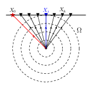

- [Main content](ch3_main.md)
- [Prev figure](ch3_fig02.md)
- [Next figure](ch3_fig04.md)


.    
**Figure 3:** Schematic view of diffracted waves. $X_0$, $X_i$, $X_k$ denote the lateral position of the source (red star), image point (blue triangle), and receiver (black triangle), respectively. $\Omega$ is the diffracted wavefront element surrounding the image point (blue triangle at lateral position $X_i$).

<span style="color:black"> **Source code used to reproduce Figure 3**: </span> <br>
<span style="color:blue"> *Dependency:* </span> [Tikz](https://www.overleaf.com/learn/latex/TikZ_package). <br>
<span style="color:blue"> *Data availability:* </span> No input data is needed.

```tex
% Schematic view of diffracted waves
% Author: Jianhuan Liu
% 20-01-2020

\documentclass[tikz,border=10pt]{standalone}
%%%<
\usepackage{amssymb}
\usepackage{verbatim}
\usepackage{xcolor}

\usepackage{tikz}
\usetikzlibrary{arrows,shapes,positioning}
\usetikzlibrary{decorations.markings}
\tikzstyle arrowstyle=[scale=1]
\usetikzlibrary{patterns,arrows,calc,decorations.pathmorphing}
\tikzstyle directed=[postaction={decorate,decoration={markings,
    mark=at position .65 with {\arrow[arrowstyle]{stealth}}}}]
\tikzstyle reverse directed=[postaction={decorate,decoration={markings,
    mark=at position .65 with {\arrowreversed[arrowstyle]{stealth};}}}]
    
% Modified \textcircled macro
\renewcommand*\textcircled[1]{\tikz[baseline=(char.base)]{
  \node [shape=circle,draw,inner sep=1pt] (char) {#1};}}

\begin{document}
\begin{tikzpicture}[scale=2.0]
    % variables for pn-junction diagram:
    % all parameters are in tikz scale
    % p-side of the junction is here on the right
%\draw[step=1cm,gray,ultra thin] (0,0) grid (4,3.);

\def\Ax{0.5}, \def\Ay{2.2} % start point
\def\Bx{2.5}, \def\By{2.2} % end point
\def\Cx{2}, \def\Cy{2.2} % imaging point
\def\Dx{1.5}, \def\Dy{1.2} % object
\def\StepX{0.3}

% ----> Step (1) <----
% define cooridinates
\coordinate (A) at (\Ax,\Ay);
\coordinate (B) at (\Bx,\By);
\coordinate (C) at (\Cx,\Cy);
\coordinate (D) at (\Dx,\Dy);


% source position, and its comment
\draw (A) node {\color{red} $\bigstar$};
\draw (\Ax, \Ay+0.15) node{\small $X_0$};


% receiver array
\foreach \i in {1,...,7}
    \draw (\Ax+\i*0.25, \Ay) node {\color{black}$\blacktriangledown$};


\draw (D) node {$\bullet$};

% connecting receivers with diffractor
\foreach \i in {1,...,7}
    \draw[black, directed] (D) -- (\Ax+\i*0.25, \Ay);

% imaging point
\draw (\Ax+4*0.25, \Ay) node {\color{blue}$\blacktriangledown$};
\draw[blue, directed] (D) -- (\Ax+4*0.25, \Ay);
\draw (\Ax+4*0.25, \Ay+0.15) node{\color{blue} \small $X_i$};

\draw (\Ax+6*0.25, \Ay+0.15) node{\small $X_k$};

% wave-front
\draw (\Ax+8*0.25, \Ay-0.45) node{\large $\Omega$};

% circles around diffractor
\foreach \i in {1,...,4}
    \draw[dashed] (D) circle(0.25*\i);
    
% connect each nodes
\draw [black,thick] (\Ax-0.2, \Ay) -- (\Bx+0.2, \By);
\draw[red,directed] (A) -- (D);


\end{tikzpicture}
\end{document}

```

<a href="#top">Back to top</a>
