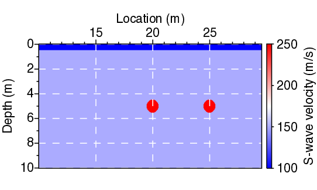

- [Main content](ch3_main.md)
- [Prev figure](ch3_fig03.md)
- [Next figure](ch3_fig57.md)

.    
**Figure 4:** S-wave velocity ($V_S$) model used to generate the synthetic common-source gathers. Two shallow diffractors with a given impedance contrast with respect to the background media are included in the model.

<span style="color:black"> **Source code used to reproduce Figure 4**: </span> <br>
<span style="color:blue"> *Dependency:* </span> [Seismic Unix](https://github.com/JohnWStockwellJr/SeisUnix). <br>
<span style="color:blue"> *Data availability:* </span> Input data is not yet available.

```sh
% S-wave velocity ($V_S$) model
% Author: Jianhuan Liu
% 23-11-2020

#!/bin/bash

WID=4.5
HEI=2.5

# - read-white-blue -
BRGB="1.000,0.000,0.000"
GRGB="1.000,1.000,1.000"
WRGB="0.000,0.000,1.000"

clip="perc=100"

# Figure 4, Synthetic Model
dir=updatedVassenSyn_2th_revision/c0modeling_fd_new/make_model

< $dir/model_cs.su suwind key=tracf min=200 max=591 |
suwind itmax=200 |
supsimage d1=0.05 d2=0.05 f1=0.001 f2=10.001  \
brgb=$BRGB grgb=$GRGB wrgb=$WRGB \
n1tic=2 n2tic=5 \
grid1=dash grid2=dash gridcolor=white gridwidth=1 \
width=$WID height=$HEI xbox=0.0 ybox=0.0 \
legend=1 lstyle=vertright lheight=$HEI \
units="S-wave velocity (m/s)" \
label1="Depth (m)" label2="Location (m)" labelsize=18 \
d1num=2 d2num=5 $clip \
lbeg=100 lend=250 lntic=5  \
bps=24 > temp/fig04_model.ps

# merge into one file
scale=0.6
psmerge translate=0.,0. scale=$scale,$scale in=temp/fig04_model.ps > figs/fig04_merge.eps

open figs/fig04_merge.eps &

```

<a href="#top">Back to top</a>
