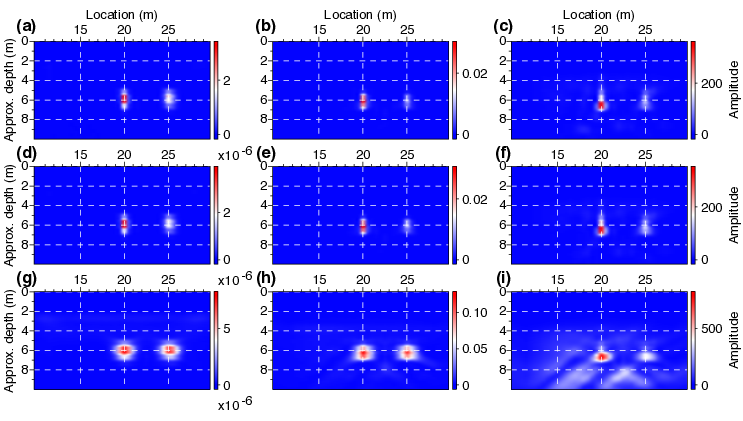

- [Main content](ch3_main.md)
- [Prev figure](ch3_fig06.md)
- [Next figure](ch3_fig09.md)


.    
**Figure 8:** Comparison of results from diffraction imaging by different approaches. (a),(b),(c) diffraction imaging of the data after Love-wave suppression by $f-k$ filtering, SI+AS, and SI+AS+SVI, respectively. Every second common-source gather is used. Phase-weighted stack (PWS) is applied to enhance the coherent summation of weak diffraction signals. (d),(e),(f) Similar to (a), (b), (c), but using all the modeled common-source gathers. (g), (h), (i) Similar to (d), (e), (f), but ordinary, linear stack is used to stack the weak diffraction signals.

<span style="color:black"> **Source code used to reproduce Figure 8**: </span> <br>
<span style="color:blue"> *Dependency:* </span> [Seismic Unix](https://github.com/JohnWStockwellJr/SeisUnix). <br>
<span style="color:blue"> *Data availability:* </span> Input data is not yet available.

```sh
% Comparison of results from diffraction imaging by different approaches
% Author: Jianhuan Liu
% 20-01-2020

#!/bin/bash

WIDTH=4.5; HEIGHT=2.5
size="width=$WIDTH height=$HEIGHT"
LHEIGHT=$(echo $HEIGHT | awk '{print $1 * 0.85}')
LWIDTH=0.15

# sample colormap:  red, green, blue
cmap="brgb=1.0,0.0,0.0 grgb=1.0,1.0,1.0 wrgb=0.0,0.0,1.0"

clip="perc=100"

dir=updatedVassenSyn_2th_revision

# FK
data1=$dir/dsection_fk_pwr_half.su
data2=$dir/dsection_fk_pwr_all.su
data3=$dir/dsection_fk_lin_all.su

# SI+AS
data4=$dir/dsection_as_pwr_half.su
data5=$dir/dsection_as_pwr_all.su
data6=$dir/dsection_as_lin_all.su

# SI+AS, SVI
data7=$dir/dsection_svi_pwr_half.su
data8=$dir/dsection_svi_pwr_all.su
data9=$dir/dsection_svi_lin_all.su

d1=$(echo 0.0005 150 | awk '{print $1*$2/2.0}')

# FK (a1,a2,a3)
< $data1 suwind itmax=266 |
supsimage d1=$d1 d2=0.5 f1=0.001 f2=10.001  \
n1tic=2 n2tic=5 \
grid1=dash grid2=dash gridcolor=white gridwidth=1 \
$cmap units= \
$size xbox=0.0 ybox=0.0 \
legend=1 lstyle=vertright lheight=$HEIGHT \
label1="Approx. depth (m)" label2="Location (m)" labelsize=24 \
d1num=2 d2num=5 $clip \
bps=24 title= > temp/fig07_a.eps


< $data2 suwind itmax=266 |
supsimage d1=$d1 d2=0.5 f1=0.001 f2=10.001  \
n1tic=2 n2tic=5 \
grid1=dash grid2=dash gridcolor=white gridwidth=1 \
$cmap units= \
$size xbox=0.0 ybox=0.0 \
legend=1 lstyle=vertright lheight=$HEIGHT \
label1="Approx. depth (m)" labelsize=24 \
d1num=2 d2num=5 $clip \
bps=24 title= > temp/fig07_b.eps

< $data3 suwind itmax=266 |
supsimage d1=$d1 d2=0.5 f1=0.001 f2=10.001  \
n1tic=2 n2tic=5 \
grid1=dash grid2=dash gridcolor=white gridwidth=1 \
$cmap units= \
$size xbox=0.0 ybox=0.0 \
legend=1 lstyle=vertright lheight=$HEIGHT \
label1="Approx. depth (m)" labelsize=24 \
d1num=2 d2num=5 $clip \
bps=24 title= > temp/fig07_c.eps

# SI+AS (b1,b2,b3)
< $data4 suwind itmax=266 |
supsimage d1=$d1 d2=0.5 f1=0.001 f2=10.001  \
n1tic=2 n2tic=5 \
grid1=dash grid2=dash gridcolor=white gridwidth=1 \
$cmap units= \
$size xbox=0.0 ybox=0.0 \
legend=1 lstyle=vertright lheight=$HEIGHT \
label1= label2="Location (m)" labelsize=24 \
d1num=2 d2num=5 $clip \
bps=24 title= > temp/fig07_d.eps

< $data5 suwind itmax=266 |
supsimage d1=$d1 d2=0.5 f1=0.001 f2=10.001  \
n1tic=2 n2tic=5 \
grid1=dash grid2=dash gridcolor=white gridwidth=1 \
$cmap units= \
$size xbox=0.0 ybox=0.0 \
legend=1 lstyle=vertright lheight=$HEIGHT \
label1= labelsize=24 \
d1num=2 d2num=5 $clip \
bps=24 title= > temp/fig07_e.eps

< $data6 suwind itmax=266 |
supsimage d1=$d1 d2=0.5 f1=0.001 f2=10.001  \
n1tic=2 n2tic=5 \
grid1=dash grid2=dash gridcolor=white gridwidth=1 \
$cmap units= \
$size xbox=0.0 ybox=0.0 \
legend=1 lstyle=vertright lheight=$HEIGHT \
label1= labelsize=24 \
d1num=2 d2num=5 $clip \
bps=24 title= > temp/fig07_f.eps

# SVI (c1,c2,c3)
< $data7 suwind itmax=266 |
supsimage d1=$d1 d2=0.5 f1=0.001 f2=10.001  \
n1tic=2 n2tic=5 \
grid1=dash grid2=dash gridcolor=white gridwidth=1 \
$cmap units="Amplitude" \
$size xbox=0.0 ybox=0.0 \
legend=1 lstyle=vertright lheight=$HEIGHT \
label1= label2="Location (m)" labelsize=24 \
d1num=2 d2num=5 $clip \
bps=24 title= > temp/fig07_g.eps

< $data8 suwind itmax=266 |
supsimage d1=$d1 d2=0.5 f1=0.001 f2=10.001  \
n1tic=2 n2tic=5 \
grid1=dash grid2=dash gridcolor=white gridwidth=1 \
$cmap units="Amplitude" \
$size xbox=0.0 ybox=0.0 \
legend=1 lstyle=vertright lheight=$HEIGHT \
label1= labelsize=24 \
d1num=2 d2num=5 $clip \
bps=24 title= > temp/fig07_h.eps

< $data9 suwind itmax=266 |
supsimage d1=$d1 d2=0.5 f1=0.001 f2=10.001  \
n1tic=2 n2tic=5 \
grid1=dash grid2=dash gridcolor=white gridwidth=1 \
$cmap units="Amplitude" \
$size xbox=0.0 ybox=0.0 \
legend=1 lstyle=vertright lheight=$HEIGHT \
label1= labelsize=24 \
d1num=2 d2num=5 $clip \
bps=24 title= > temp/fig07_i.eps


# calculate (x,y) positions of each subfigs
scale=0.5; dX=0.8; dY=0.35
# 1st row
x1=0; y1=0
x2=$(echo $WIDTH $scale $dX| awk '{print $1 * $2 + $3}'); y2=$y1
x3=$(echo $WIDTH $scale $x2 $dX| awk '{print $1 * $2 + $3 + $4}'); y3=$y1

# 2st row
x4=0; y4=$(echo $HEIGHT $scale $dY| awk '{print $1 * $2 + $3}');
x5=$x2; y5=$y4
x6=$x3; y6=$y4

# 3st row
x7=0; y7=$(echo $HEIGHT $scale $y4 $dY| awk '{print $1 * $2 + $3 + $4}');
x8=$x2; y8=$y7
x9=$x3; y9=$y7

# merge into one file
psmerge translate=$x1,$y1 scale=$scale,$scale in=temp/fig07_c.eps \
translate=$x2,$y2 scale=$scale,$scale in=temp/fig07_f.eps \
translate=$x3,$y3 scale=$scale,$scale in=temp/fig07_i.eps \
translate=$x4,$y4 scale=$scale,$scale in=temp/fig07_b.eps \
translate=$x5,$y5 scale=$scale,$scale in=temp/fig07_e.eps \
translate=$x6,$y6 scale=$scale,$scale in=temp/fig07_h.eps \
translate=$x7,$y7 scale=$scale,$scale in=temp/fig07_a.eps \
translate=$x8,$y8 scale=$scale,$scale in=temp/fig07_d.eps \
translate=$x9,$y9 scale=$scale,$scale in=temp/fig07_g.eps > figs/fig07_merge.eps

open figs/fig07_merge.eps &


```

<a href="#top">Back to top</a>
