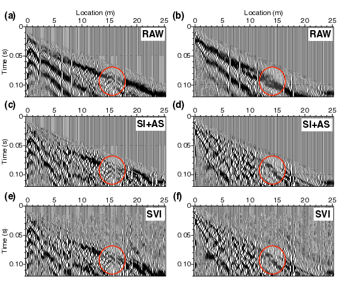

- [Main content](ch3_main.md)
- [Prev figure](ch3_fig08.md)
- [Next figure](ch3_fig10.md)

.    
**Figure 9:** (a) A typical preprocessed SH-wave shot gather from the field data acquired using a sledge-hammer source. The gather is dominated by strong Love waves. (c) Result after Love-wave suppression by SI+AS; (e) result after diffraction enhancement by SVI; (b),(d),(f) are the same as (a),(c),(e), but using S-wave vibrator as the source. The first $101$ traces are displayed.

<span style="color:black"> **Source code used to reproduce Figure 9**: </span> <br>
<span style="color:blue"> *Dependency:* </span> [Seismic Unix](https://github.com/JohnWStockwellJr/SeisUnix). <br>
<span style="color:blue"> *Data availability:* </span> Input data is not yet available.

**Source code (1):**
```sh
% A typical preprocessed SH-wave shot gather processed by SI+AS+SVI.
% Author: Jianhuan Liu
% 20-01-2020

#!/bin/bash
#
# Plot gathers that show steps of SW removal, diffraction enhancement

# Figure 2, (a)
fldr=3 #3
((fd=$fldr-2))

#size="wbox=5 hbox=2.5"
size="wbox=5 hbox=2.5"
tmax=0.12
clip="perc=99"

windowing="suwind key=tracf min=1 max=101 j=1"


# raw data
< fieldData/data/shot_raw_${fldr}.su \
$windowing |
suwind tmax=$tmax | sunormalize norm=max |
supswigp xbox=0.0 ybox=0.0 $size $clip  \
x1beg=0 x1end=$tmax  d1num=0.05 n1tic=5 \
d2num=5 n2tic=5 f2=0 d2=0.25 \
labelsize=18 label2="Location (m)"  > temp/fig08a_raw.eps

# AS data
< fieldData/data/shot_as_${fldr}.su \
$windowing |
suwind tmax=$tmax | sunormalize norm=max |
supswigp xbox=0.0 ybox=0.0 $size $clip  \
x1beg=0 x1end=$tmax  d1num=0.05 n1tic=5 \
d2num=5 n2tic=5 f2=0 d2=0.25 \
labelsize=18  > temp/fig08a_as.eps

# SVI data
< fieldData/shots_svi.su suwind key=fldr min=$fd max=$fd |
$windowing |
suwind tmax=$tmax | sunormalize norm=max |
supswigp xbox=0.0 ybox=0.0 $size $clip  \
x1beg=0 x1end=$tmax  d1num=0.05 n1tic=5 \
d2num=5 n2tic=5 f2=0 d2=0.25 \
labelsize=18  > temp/fig08a_svi.eps

# merge into one file
psmerge translate=0.,0. scale=0.5,0.5 in=temp/fig08a_svi.eps \
translate=0,1.6 scale=0.5,0.5 in=temp/fig08a_as.eps \
translate=0,3.2 scale=0.5,0.5 in=temp/fig08a_raw.eps > figs/fig08a_merge.eps

open figs/fig08a_merge.eps &

```

**Source code (2):**
```sh
#!/bin/bash
#
# Plot gathers that show steps of SW removal, diffraction enhancement

# Figure 2, (a)
fldr=3
((fd=$fldr-2))

size="wbox=5 hbox=2.5"
tmax=0.12
clip="perc=99"

windowing="suwind key=tracf min=1 max=101 j=1"

# raw data
< fieldHData/data/shot_raw_${fldr}.su \
$windowing |
suwind key=tracf min=1 max=$traces |
suwind tmax=$tmax | sunormalize norm=max |
supswigp xbox=0.0 ybox=0.0 $size $clip  \
x1beg=0 x1end=0.15  d1num=0.05 n1tic=5 \
d2num=5 n2tic=5 f2=0 d2=0.25 \
labelsize=18 label2="Location (m)" label1="Time (s)" > temp/fig08b_raw.eps

# AS data
< fieldHData/data/shot_as_${fldr}.su \
$windowing |
suwind tmax=$tmax | sunormalize norm=max |
supswigp xbox=0.0 ybox=0.0 $size $clip  \
x1beg=0 x1end=0.15  d1num=0.05 n1tic=5 \
d2num=5 n2tic=5 f2=0 d2=0.25 \
labelsize=18 label1="Time (s)" > temp/fig08b_as.eps

# SVI data
< fieldHData/data/shots_svi.su suwind key=fldr min=$fd max=$fd |
$windowing |
suwind tmax=$tmax | sunormalize norm=max |
supswigp xbox=0.0 ybox=0.0 $size $clip  \
x1beg=0 x1end=0.15  d1num=0.05 n1tic=5 \
d2num=5 n2tic=5 f2=0 d2=0.25 \
labelsize=18 label1="Time (s)"  > temp/fig08b_svi.eps

# merge into one file
psmerge translate=0.,0. scale=0.5,0.5 in=temp/fig08b_svi.eps \
translate=0,1.6 scale=0.5,0.5 in=temp/fig08b_as.eps \
translate=0,3.2 scale=0.5,0.5 in=temp/fig08b_raw.eps > figs/fig08b_merge.eps

# merge with vibrator gathers
psmerge translate=0.,0. scale=1.,1. in=figs/fig08b_merge.eps \
translate=3.0,0 scale=1.,1. in=figs/fig08a_merge.eps > figs/fig08_all.eps

open figs/fig08_all.eps &

```

<a href="#top">Back to top</a>
