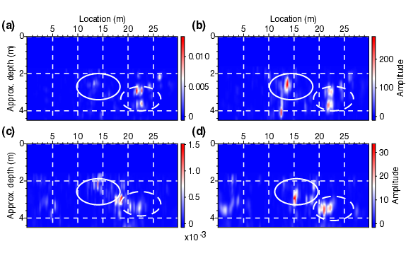

- [Main content](ch3_main.md)
- [Prev figure](ch3_fig09.md)
- [Next figure](ch3_fig11.md)

.    
**Figure 10:** Diffraction imaging result obtained from the field seismic data following our proposed workflow \ref{fig:workflow}: (a) sledge-hammer data after Love-wave suppression by SI+AS; (b) sledge-hammer data after Love-wave suppression by SI+AS and diffraction enhancement by SVI; (c), (d) are same as (a), (b) but using S-wave vibrator data. High-amplitude anomalies (solid and dashed ellipses) indicate the potential locations of subsurface diffractor-like objects. 

<span style="color:black"> **Source code used to reproduce Figure 10**: </span> <br>
<span style="color:blue"> *Dependency:* </span> [Seismic Unix](https://github.com/JohnWStockwellJr/SeisUnix). <br>
<span style="color:blue"> *Data availability:* </span> Input data is not yet available.

```sh
% Diffraction imaging result from field data
% Author: Jianhuan Liu
% 20-01-2020

#!/bin/bash
#
# Plot diffraction sections from vibrator and hammer data
#
 
WID=4.5
HEI=2.5

# - read-white-blue -
BRGB="1.000,0.000,0.000"
GRGB="1.000,1.000,1.000"
WRGB="0.000,0.000,1.000"

tmax=0.1
clip="perc=100"
tr1=1; tr2=120

#dir=fieldData
dir=diff_Vassen_updated

# Figure 1, diffraction section (hammer,svi)
< $dir/dsection_hammer_svi.su suwind tmax=$tmax |
suwind key=tracl min=$tr1 max=$tr2 |
supsimage d1=0.01125 d2=0.25 f2=0.0001  \
brgb=$BRGB grgb=$GRGB wrgb=$WRGB units="Amplitude" \
n1tic=5 n2tic=5 \
grid1=dash grid2=dash gridcolor=white gridwidth=2 \
width=$WID height=$HEI xbox=0.0 ybox=0.0 \
legend=1 lstyle=vertright lheight=$HEI \
label1= label2="Location (m)" labelsize=18 \
d1num=2 d2num=5 $clip \
bps=24 title= > temp/fig09_hammer_svi.eps
#bps=24 title=h_svi > temp/fig09_hammer_svi.ps

# Figure 2, diffraction section (vibrator,svi)
< $dir/dsection_xcor_svi.su suwind tmax=$tmax |
suwind key=tracl min=$tr1 max=$tr2 |
supsimage d1=0.0225 d2=0.25 f2=0.0001  \
brgb=$BRGB grgb=$GRGB wrgb=$WRGB units="Amplitude" \
n1tic=5 n2tic=5 \
grid1=dash grid2=dash gridcolor=white gridwidth=2 \
width=$WID height=$HEI xbox=0.0 ybox=0.0 \
legend=1 lstyle=vertright lheight=$HEI \
label1= label2= labelsize=18 \
d1num=2 d2num=5 $clip  \
bps=24 title= > temp/fig09_xcor_svi.eps
#bps=24 title=x_svi > temp/fig09_xcor_svi.ps

# Figure 3, diffraction section (hammer,as)
< $dir/dsection_hammer.su suwind tmax=$tmax |
suwind key=tracl min=$tr1 max=$tr2 |
supsimage d1=0.01125 d2=0.25 f2=0.0001  \
brgb=$BRGB grgb=$GRGB wrgb=$WRGB units= \
n1tic=5 n2tic=5 \
grid1=dash grid2=dash gridcolor=white gridwidth=2 \
width=$WID height=$HEI xbox=0.0 ybox=0.0 \
legend=1 lstyle=vertright lheight=$HEI \
label1="Approx. depth (m)" label2="Location (m)" labelsize=18 \
d1num=2 d2num=5 $clip \
bps=24 title= > temp/fig09_hammer_as.eps
#bps=24 title=h_as > temp/fig09_hammer_as.ps

# Figure 4, diffraction section (vibrator,as)
< $dir/dsection_xcor_as.su suwind tmax=$tmax |
suwind key=tracl min=$tr1 max=$tr2 |
supsimage d1=0.0225 d2=0.25 f2=0.0001  \
brgb=$BRGB grgb=$GRGB wrgb=$WRGB units= \
n1tic=5 n2tic=5 \
grid1=dash grid2=dash gridcolor=white gridwidth=2 \
width=$WID height=$HEI xbox=0.0 ybox=0.0 \
legend=1 lstyle=vertright lheight=$HEI \
label1="Approx. depth (m)" label2= labelsize=18 \
d1num=2 d2num=5 $clip  \
bps=24 title= > temp/fig09_xcor_as.eps
#bps=24 title=x_as > temp/fig09_xcor_as.ps

# calculate (x,y) positions of each subfigs
scale=0.5; dX=0.6; dY=0.35
# 1st row
x1=0; y1=0
x2=$(echo $WID $scale $dX| awk '{print $1 * $2 + $3}'); y2=$y1

# 2st row
x3=0; y3=$(echo $HEI $scale $dY| awk '{print $1 * $2 + $3}');
x4=$x2; y4=$y3

# merge into one file
psmerge translate=$x1,$y1 scale=$scale,$scale in=temp/fig09_xcor_as.eps \
translate=$x2,$y2 scale=$scale,$scale in=temp/fig09_xcor_svi.eps \
translate=$x3,$y3 scale=$scale,$scale in=temp/fig09_hammer_as.eps \
translate=$x4,$y4 scale=$scale,$scale in=temp/fig09_hammer_svi.eps > figs/fig09_merge.eps

open figs/fig09_merge.eps &

```

<a href="#top">Back to top</a>
