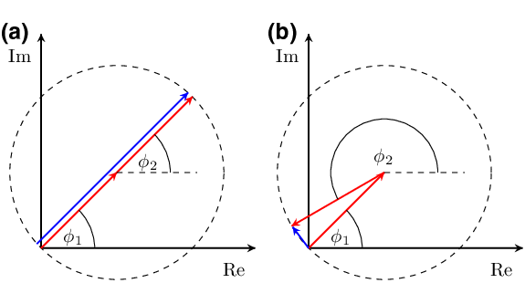

- [Main content](ch3_main.md)
- [Prev figure](ch3_fig11.md)

.    
**Figure 12:** Illustrations of the summation of $exp[i\phi_{1}(t)]$ and $exp[i\phi_{2}(t)]$ in the complex plane. Red arrows denote these two vectors, while the blue vector is the addition of these two vectors. (a) When two signals have the same instantaneous phase ($\phi_{1}(t) = \phi_{2}(t)$), the amplitude of the phase sum (blue arrow) will be $2$, and the corresponding value of $c(t)$ will be $1$. (b) When two signals have significantly different instantaneous phases, the amplitude of the phase sum (blue arrow) and the corresponding value of $c(t)$ will be approximately $0$. Modified from Schimmel and Paulssen (1997). 

<span style="color:black"> **Source code used to reproduce Figure 12**: </span> <br>
<span style="color:blue"> *Dependency:* </span> [Tikz](https://www.overleaf.com/learn/latex/TikZ_package). <br>
<span style="color:blue"> *Data availability:* </span> No input data is needed.

```tex
% Schemes for PWS
% Author: Jianhuan Liu
% 20-01-2020

\documentclass[tikz,border=10pt]{standalone}
%%%<
\usepackage{amssymb}
\usepackage{verbatim}
\usepackage{xcolor}

\usepackage{tikz}

\usetikzlibrary{arrows,shapes,positioning}
\usetikzlibrary{decorations.markings}
\tikzstyle arrowstyle=[scale=1]
\usetikzlibrary{patterns,arrows,calc,decorations.pathmorphing}
\tikzstyle directed=[postaction={decorate,decoration={markings,
    mark=at position 1.0 with {\arrow[arrowstyle]{stealth}}}}]
\tikzstyle reverse directed=[postaction={decorate,decoration={markings,
    mark=at position 1.0 with {\arrowreversed[arrowstyle]{stealth};}}}]
    
% Modified \textcircled macro
\renewcommand*\textcircled[1]{\tikz[baseline=(char.base)]{
  \node [shape=circle,draw,inner sep=1pt] (char) {#1};}}

\begin{document}
\begin{tikzpicture}[scale=2.0]
    % variables for pn-junction diagram:
    % all parameters are in tikz scale
    % p-side of the junction is here on the right
%\draw[step=1cm,gray,ultra thin] (0,0) grid (8,4);

\def\Ox{0}, \def\Oy{0} % start point
\def\Ax{2.}, \def\Ay{0} % end point
\def\Bx{0}, \def\By{2.} % imaging point
\def\Cx{0.70710678}, \def\Cy{0.70710678} % object


\def\StepX{0.5}
\def\StepY{0.5}

% ----> Step (1) <----
% define cooridinates
\coordinate (O) at (\Ox,\Oy);
\coordinate (A) at (\Ax,\Ay);
\coordinate (B) at (\Bx,\By);
\coordinate (C) at (\Cx,\Cy);

% ---- circle one ----
\draw[black,thick, directed] (\Ox + \StepX, \Oy + \StepY) -- (\Ax + \StepX, \Ay + \StepY);
\draw[black,thick, directed] (\Ox + \StepX, \Oy + \StepY) -- (\Bx + \StepX, \By + \StepY);
\draw[dashed] (\Cx + \StepX, \Cy + \StepY) circle(1.0);

% labels
\draw(\Ax + \StepX - 0.2, \Ay + \StepY - 0.2) node {Re};
\draw(\Bx + \StepX - 0.2, \By + \StepY - 0.2) node {Im};

% rays
\draw[red,thick, directed,thick] (\Ox + \StepX, \Oy + \StepY) -- (\Cx + \StepX, \Cy + \StepY);
\draw[red,thick, directed,thick] (\Cx + \StepX, \Cy + \StepY) -- (2*\Cx + \StepX, 2*\Cy + \StepY);
\draw[blue, directed,thick] (\StepX - 0.04,  \StepY + 0.04) -- (2*\Cx - 0.04 + \StepX, 2*\Cy + \StepY + 0.04);

% dashed line
\draw[dashed] (\Cx + \StepX, \Cy + \StepY) -- (0.75 + \Cx + \StepX, \Cy + \StepY);

% angles
\def\aX{0.8} , \def\aY{0.6} % Theta 1
\def\bX{1.5} , \def\bY{1.3} % Theta 2

\draw (\StepX + 0.25* \Ax, \StepY) arc (0:45:0.5);
\node[] at (\aX, \aY) {$\phi_{1}$};

\draw (\StepX + \Cx + 0.5, \StepY + \Cy ) arc (0:45:0.5);
\node[] at (\bX, \bY) {$\phi_{2}$};


% circle three
\draw[black,thick,directed] (2.5 + \Ox + \StepX, \Oy + \StepY) -- (2.5 + \Ax + \StepX, \Ay + \StepY);
\draw[black, thick,directed] (2.5 + \Ox + \StepX, \Oy + \StepY) -- (2.5 +\Bx + \StepX, \By + \StepY);
\draw[dashed] (2.5+ \Cx + \StepX, \Cy + \StepY) circle(1.0);
\draw(2.5 + \Ax + \StepX - 0.2, \Ay + \StepY - 0.2) node {Re};
\draw(2.5 + \Bx + \StepX - 0.2, \By + \StepY - 0.2) node {Im};

% rays
\draw[red,thick, directed] (2.5+ \Ox + \StepX, \Oy + \StepY) -- (2.5 + \Cx + \StepX, \Cy + \StepY);
\draw[red,thick, directed] (2.5 + \Cx + \StepX, \Cy + \StepY) -- (2.5 + \Cx + \StepX - 0.8660254, \Cy + \StepY - 0.5);
\draw[blue, directed,thick] (2.5+ \Ox + \StepX, \Oy + \StepY) -- (2.5 + \Cx + \StepX - 0.8660254+0.01, \Cy + \StepY -0.5 - 0.01);

% dashed line
\draw[dashed] (2.5 +\Cx + \StepX, \Cy + \StepY) -- (2.5 + 0.75 + \Cx + \StepX, \Cy + \StepY);

% angles
\draw (\StepX + 0.25* \Ax + 2.5, \StepY) arc (0:45:0.5);

\draw (\StepX + \Cx + 0.5 + 2.5, \StepY + \Cy ) arc (0:210:0.5);

\node[] at (\aX+2.5, \aY) {$\phi_{1}$};
\node[] at (\bX+2.5-0.3, \bY+0.05) {$\phi_{2}$};

\end{tikzpicture}
\end{document}

```

<a href="#top">Back to top</a>
