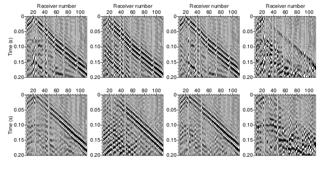

- [Main content](ch5_main.md)
- [Prev figure](ch5_fig02.md)
- [Next figure](ch5_fig04.md)


**Figure  3:** (a) A typical preprocessed SH-wave shot gather from the field data acquired along Line A using S-wave vibrator as the source. The preprocessing steps include trace editing, band-pass filtering; (b) retrieved Love waves from the gather as shown in Figure 3(a); (c) result after convolution of the data in (b) with a non-stationary matching filter to account for the inaccurancy of retrieval during the procedure of SVI; (d) result after subtraction of Figure 3(c) from Figure 3(a). (e), (f), (g), (h) are the same with (a), (b), (c), (d), but for a common-source gather with a different source position. Every second trace between are presented.
    

<span style="color:black"> **Source code used to reproduce Figure 3**: </span> <br>
<span style="color:blue"> *Dependency:* </span> [Seismic Unix](https://github.com/JohnWStockwellJr/SeisUnix). <br>
<span style="color:blue"> *Data availability:* </span> Input data is not yet available.


**Source code (1)**


```sh
#!/bin/bash
#
# plot different components of raw shot gathers
# 28-09-2020, J.Liu

WIDTH=4.
HEIGHT=4.

# Figure 3, (a)
fldr=25

size="wbox=$WIDTH hbox=$HEIGHT"
tmax=0.2
clip="perc=99"

dir=firstLine/Preprocessed_Line01/temp

windowing="suwind key=tracf min=10 max=110 j=2"
filtering="sufilter f=5,10,70,80 amp=0,1,1,0"

# (1) raw gather
< $dir/shot_raw_${fldr}.su $windowing |
sunormalize norm=max | $filtering |
supswigp xbox=0.0 ybox=0.0 $size $clip  \
x1beg=0 x1end=$tmax d1num=0.05 n1tic=5 \
d2num=20 n2tic=5 key=tracf \
labelsize=24 label2="Receiver number" label1="Time (s)" > temp/fig03_raw.eps 

# (2) retrieved gather by SVI
< $dir/shot_svi_${fldr}.su $windowing |
sunormalize norm=max | $filtering |
supswigp xbox=0.0 ybox=0.0 $size $clip  \
x1beg=0 x1end=$tmax  d1num=0.05 n1tic=5 \
d2num=20 n2tic=5 key=tracf \
labelsize=24 label2="Receiver number" label1= > temp/fig03_svi.eps 

# (3) retrieved gather after shaping
< $dir/shot_sw_${fldr}.su $windowing |
sunormalize norm=max | $filtering |
supswigp xbox=0.0 ybox=0.0 $size $clip  \
x1beg=0 x1end=$tmax  d1num=0.05 n1tic=5 \
d2num=20 n2tic=5 key=tracf \
labelsize=24 label2="Receiver number" label1= > temp/fig03_sw.eps 

# (4) raw gather after subtraction of SWs
< $dir/shot_as_${fldr}.su $windowing |
sunormalize norm=max | $filtering |
supswigp xbox=0.0 ybox=0.0 $size $clip  \
x1beg=0 x1end=$tmax  d1num=0.05 n1tic=5 \
d2num=20 n2tic=5 key=tracf \
labelsize=24 label2="Receiver number" label1= > temp/fig03_as.eps 

# calculate (x,y) positions of each subfigs
scale=0.35; dX=0.35
# 1st row
x1=0; y1=0
x2=$(echo $WIDTH $scale $dX| awk '{print $1 * $2 + $3}'); y2=$y1
x3=$(echo $WIDTH $scale $x2 $dX| awk '{print $1 * $2 + $3 + $4}'); y3=$y1
x4=$(echo $WIDTH $scale $x3 $dX| awk '{print $1 * $2 + $3 + $4}'); y4=$y1

# merge into one file
psmerge translate=$x1,$y1 scale=$scale,$scale in=temp/fig03_raw.eps \
translate=$x2,$y2 scale=$scale,$scale in=temp/fig03_svi.eps \
translate=$x3,$y3 scale=$scale,$scale in=temp/fig03_sw.eps \
translate=$x4,$y4 scale=$scale,$scale in=temp/fig03_as.eps > figs/fig03a.eps

#open figs/fig03a.eps &

```


**Source code (2)**

```sh
#!/bin/bash
#
# plot different components of raw shot gathers
# 28-09-2020, J.Liu

WIDTH=4.
HEIGHT=4.

# Figure 3, (b)
fldr=50

size="wbox=$WIDTH hbox=$HEIGHT"
tmax=0.2
clip="perc=99"

dir=firstLine/Preprocessed_Line01/temp

windowing="suwind key=tracf min=10 max=110 j=2"
filtering="sufilter f=5,10,70,80 amp=0,1,1,0"

# (1) raw gather
< $dir/shot_raw_${fldr}.su $windowing |
sunormalize norm=max | $filtering |
supswigp xbox=0.0 ybox=0.0 $size $clip  \
x1beg=0 x1end=$tmax d1num=0.05 n1tic=5 \
d2num=20 n2tic=5 key=tracf \
labelsize=24 label2=  label1="Time (s)" > temp/fig03_raw.eps 

# (2) retrieved gather by SVI
< $dir/shot_svi_${fldr}.su $windowing |
sunormalize norm=max | $filtering |
supswigp xbox=0.0 ybox=0.0 $size $clip  \
x1beg=0 x1end=$tmax  d1num=0.05 n1tic=5 \
d2num=20 n2tic=5 key=tracf \
labelsize=24 label2=  label1= > temp/fig03_svi.eps 

# (3) retrieved gather after shaping
< $dir/shot_sw_${fldr}.su $windowing |
sunormalize norm=max | $filtering |
supswigp xbox=0.0 ybox=0.0 $size $clip  \
x1beg=0 x1end=$tmax  d1num=0.05 n1tic=5 \
d2num=20 n2tic=5 key=tracf \
labelsize=24 label2=  label1= > temp/fig03_sw.eps 

# (4) raw gather after subtraction of SWs
< $dir/shot_as_${fldr}.su $windowing |
sunormalize norm=max | $filtering |
supswigp xbox=0.0 ybox=0.0 $size $clip  \
x1beg=0 x1end=$tmax  d1num=0.05 n1tic=5 \
d2num=20 n2tic=5 key=tracf \
labelsize=24 label2=  label1= > temp/fig03_as.eps 

# calculate (x,y) positions of each subfigs
scale=0.35; dX=0.35
# 1st row
x1=0; y1=0
x2=$(echo $WIDTH $scale $dX| awk '{print $1 * $2 + $3}'); y2=$y1
x3=$(echo $WIDTH $scale $x2 $dX| awk '{print $1 * $2 + $3 + $4}'); y3=$y1
x4=$(echo $WIDTH $scale $x3 $dX| awk '{print $1 * $2 + $3 + $4}'); y4=$y1

# merge into one file
psmerge translate=$x1,$y1 scale=$scale,$scale in=temp/fig03_raw.eps \
translate=$x2,$y2 scale=$scale,$scale in=temp/fig03_svi.eps \
translate=$x3,$y3 scale=$scale,$scale in=temp/fig03_sw.eps \
translate=$x4,$y4 scale=$scale,$scale in=temp/fig03_as.eps > figs/fig03b.eps

#open figs/fig03b.eps &

exit
```


**Source code (3)**

```sh
#!/bin/bash
#
# combine subfigures for (fldr=25,50)
# 28-09-2020, J.Liu

./t03a_plotsvi_steps.scr
./t03b_plotsvi_steps.scr

HEIGHT=1.0
scale=1.0; dY=0.8

# calculate (x,y) positions of each subfigs
x1=0; y1=0
y2=$(echo $HEIGHT $scale $dY| awk '{print $1 * $2 + $3}'); x2=$x1

# merge into one file
psmerge translate=$x1,$y1 scale=$scale,$scale in=figs/fig03b.eps \
translate=$x2,$y2 scale=$scale,$scale in=figs/fig03a.eps > figs/fig03_merge.eps

open figs/fig03_merge.eps &
```


<a href="#top">Back to top</a>
