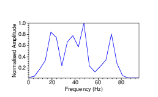

- [Main content](ch5_main.md)
- [Prev figure](ch5_fig03.md)
- [Next figure](ch5_fig05.md)

.
**Figure 4:** Average frequency spectrum of the 105 common-source gathers similar to data as in Figure 3(c).
    

<span style="color:black"> **Source code used to reproduce Figure 4**: </span> <br>
<span style="color:blue"> *Dependency:* </span> [Seismic Unix](https://github.com/JohnWStockwellJr/SeisUnix). <br>
<span style="color:blue"> *Data availability:* </span> Input data is not yet available.


```sh
#!/bin/bash
#
# plot average spectrum of collected gathers
# 28-09-2020, J.Liu

WIDTH=5; HEIGHT=2.5
size="wbox=$WIDTH hbox=$HEIGHT"

dir=firstLine/Preprocessed_Line01
#data=$dir/dreumel_LIN01_xcor_pre.su
data=$dir/LIN01_shots_raw.su

filtering="sufilter f=5,10,70,80 amp=0,1,1,0"
 
< $data suwind key=fldr min=1 max=105 |
suwind key=tracf min=1 max=120 | $filtering |
suresamp rf=1 |sustack key=dt |
sufft | suamp mode=amp | sunormalize norm=max | 
suwind itmax=20 |
supsgraph xbox=0 ybox=0 $size labelsize=18 \
n1tic=5 d1num=20 n2tic=5 d2num=0.2\
linewidth=1 linecolor=blue label1="Frequency (Hz)" \
label2="Normalised Amplitude" style=normal > temp/fig04_amp.ps

scale=0.5; dH=0.5
b_x=0; b_y=0
a_x=0; a_y=$(echo $HEIGHT $scale $dH| awk '{print $1 * $2 + $3}')
echo a_y=$a_y

# merge into one file
psmerge translate=$a_x,$a_y scale=$scale,$scale in=temp/fig04_amp.ps  > figs/fig04_merge.ps

open figs/fig04_merge.ps &

```

<a href="#top">Back to top</a>

