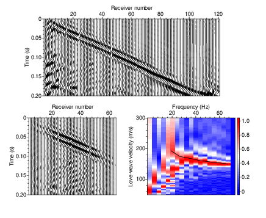

- [Main content](ch5_main.md)
- [Prev figure](ch5_fig04.md)
- [Next figure](ch5_fig67.md)

.
**Figure 5:** (a) A typical shot gather as in data in Figure 3(c), with source positioned at 18.5 m; (b) local wavefield around 30th receiver extracted from Figure 5(a) using a Gaussian window with a width of 8 m; (c) dispersion image of the data in Figure 5(b) calculated by a slant-stack procedure. The black line denotes the picked Love-wave dispersion curve of fundamental mode, which is used to invert the 1D profile under the 30th receiver.
    

<span style="color:black"> **Source code used to reproduce Figure 5**: </span> <br>
<span style="color:blue"> *Dependency:* </span> [Seismic Unix](https://github.com/JohnWStockwellJr/SeisUnix). <br>
<span style="color:blue"> *Data availability:* </span> Input data is not yet available.


```sh
#!/bin/bash
#
# full shot gather, its local wavefield and dispersion image.
# 28-09-2020, J.Liu

HEIGHT=3.5
LHEIGHT=$(echo $HEIGHT | awk '{print $1 }')
LWIDTH=0.10

clip="perc=99"

offset=80000
position="x0=$offset xw=40000"  
filtering="sufilter f=3,5,80,90 amps=0,1,1,0"

# sample colormap:  red, green, blue
#cmap="bhls=0.666666,.5,1 ghls=.3333,.5,1 whls=0,.5,1"
cmap="wrgb=0.0,0.0,1.0 grgb=1.0,1.0,1.0 brgb=1.0,0.0,0.0"

tmax=0.2
fldr=40

rawData=LIN01_shots_sw.su

WIDTH=8.0; HEIGHT=3.5
geometry="xbox=0 ybox=0 wbox=$WIDTH hbox=$HEIGHT"
# (1) raw data (x-t, wiggle)
< $rawData suwind key=fldr min=$fldr max=$fldr |
sunormalize norm=max | suwind key=tracf min=1 max=120 | 
suwind tmax=$tmax | $filtering |
supswigp $geometry $clip key=tracf \
x1beg=0 x1end=$tmax f1=0 d1num=0.05 n1tic=5 \
f2=1 d2num=20 n2tic=5 \
labelsize=18 label2="Receiver number" label1="Time (s)" > temp/fig05_a.eps 

WIDTH=4.0; HEIGHT=3.5
geometry="xbox=0 ybox=0 wbox=$WIDTH hbox=$HEIGHT"

# (2) local wavefield (x-t, wiggle)
< $rawData suwind key=fldr min=$fldr max=$fldr |
sunormalize norm=max |
suwind tmax=$tmax |
suchw key1=offset key2=gx key3=sx b=1 c=-1 | $filtering |
sugausstaper key=offset $position |
suwind key=tracf min=5 max=64 |
supswigp $geometry $clip key=tracf \
x1beg=0 x1end=$tmax f1=0 d1num=0.05 n1tic=5 \
f2=1 d2num=20 n2tic=5 \
labelsize=18 label2="Receiver number" label1="Time (s)" > temp/fig05_b.eps 

# (3) determine the number of picked points
npair=$(wc -l picked_disp/disp.fldr${fldr} | awk '{print $1}')
echo "Number of picked dispersion point is $npair"

WIDTH=4.0; HEIGHT=3.5
geometry="xbox=0 ybox=0 width=$WIDTH height=$HEIGHT"

< $rawData suwind key=fldr min=$fldr max=$fldr |
suchw key1=offset key2=gx key3=sx b=1 c=-1 | $filtering |
sugausstaper key=offset $position |
supomegal nray=251 coord=1 xsca=10000 vmin=50.0 vmax=300\
fmin=0.0 fmax=70.0 flip=1 |
sunan verbose=0 | 
sunormalize norm=max |
suflip flip=3 > tmp.sw2 

< tmp.sw2 supsimage f1=300 d1=-1 d1num= n1tic=5 \
n2tic=5 d2num=20 \
legend=1 lstyle=vertright lheight=$LHEIGHT lwidth=$LWIDTH \
units= \
curve=picked_disp/disp.fldr${fldr} npair=$npair curvecolor=black \
label1="Love-wave velocity (m/s)" label2="Frequency (Hz)" labelsize=18 \
$cmap $geometry $clip > temp/fig05_c.eps

#open temp/fig05_c.eps &

# calculate (x,y) positions of each subtemp
scale=0.5; dX=0.7; dY=0.5
# 1st row
x1=0; y1=0
x2=$(echo $WIDTH $scale $dX| awk '{print $1 * $2 + $3}'); y2=$y1
x3=0.35; y3=$(echo $HEIGHT $scale $dY| awk '{print $1 * $2 + $3}')

# merge into one file
psmerge translate=$x1,$y1 scale=$scale,$scale in=temp/fig05_b.eps \
translate=$x2,$y2 scale=$scale,$scale in=temp/fig05_c.eps \
translate=$x3,$y3 scale=$scale,$scale in=temp/fig05_a.eps > temp/fig05_merge.eps

open temp/fig05_merge.eps &

```

<a href="#top">Back to top</a>

