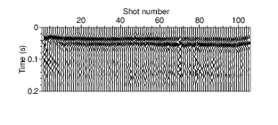

- [Main content](ch5_main.md)
- [Prev figure](ch5_fig05.md)
- [Next figure](ch5_fig09.md)

.
**Figure 8:** Estimated source wavelets for the 105 shot gathers with a bandwidth between 5 and 80 Hz. These source signatures were obtained by deconvolution of recorded data with the Green's function according to equation (2).
    

<span style="color:black"> **Source code used to reproduce Figure 8**: </span> <br>
<span style="color:blue"> *Dependency:* </span> [Seismic Unix](https://github.com/JohnWStockwellJr/SeisUnix). <br>
<span style="color:blue"> *Data availability:* </span> Input data is not yet available.


```sh
#!/bin/bash
#
# plot estimated source wavelets
# 28-09-2020, J.Liu

HEIGHT=2
WIDTH=6.5

clip="perc=99"
dir=firstLine/par_1st_L9/wavelet
fd1=1; fd2=105

rm -f temp/wavelet.bin
for ((fldr=$fd1; fldr<=$fd2; fldr++)) do
    a2b < $dir/wavelet_profile2_shot_${fldr}.dat n1=1 >> temp/wavelet.bin 
done

# mkdir empty trace
sunull nt=8000 ntr=$fd2 dt=0.000025 |
sustrip head=temp/new_head > temp/dummy_data

# paster data & header
supaste < temp/wavelet.bin ns=8000 \
head=temp/new_head > temp/wavelet.su

tmax=0.2
< temp/wavelet.su sushw key=tracf a=1 b=1 |
suresamp rf=0.1 |
suwind tmax=$tmax | sunormalize norm=max |
supswigp xbox=0.0 ybox=0.0 wbox=$WIDTH hbox=$HEIGHT $clip  \
x1beg=0 x1end=$tmax f1=0 d1=0.00025 d1num=0.1 n1tic=5 \
f2=1 d2num=20 n2tic=5 title= \
labelsize=18 label2="Shot number" label1="Time (s)" > temp/fig05_a.eps

# merge into one file
scale=0.5
psmerge translate=0,0 scale=$scale,$scale in=temp/fig05_a.eps > figs/fig05.eps

open figs/fig05.eps &

```

<a href="#top">Back to top</a>

