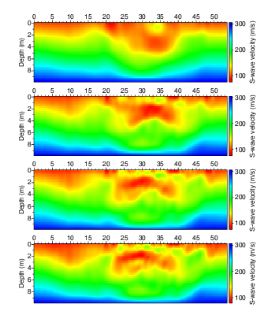

- [Main content](ch5_main.md)
- [Prev figure](ch5_fig09.md)
- [Next figure](ch5_fig11.md)

.

**Figure 10:** Field experiment result of $V_S$ from data as in Figure 3(a) and Figure a(c). (a) initial S-wave velocity model used for inversion; (b) inverted result at banwidth of 5-10 Hz, 20-30 Hz, 40-50 Hz, respectively. (good to put the initial model as a separate figure)
    

<span style="color:black"> **Source code used to reproduce Figure 10**: </span> <br>
<span style="color:blue"> *Dependency:* </span> [Seismic Unix](https://github.com/JohnWStockwellJr/SeisUnix). <br>
<span style="color:blue"> *Data availability:* </span> Input data is not yet available.


```sh
#!/bin/bash
#
# plot synthetic model, and its initial mode
# 28-09-2020, J.Liu

HEIGHT=3.0
WIDTH=$(echo 39.75 12.25 $HEIGHT | awk '{print $1*$3/$2}') 
size="width=$WIDTH height=$HEIGHT"
LHEIGHT=$(echo $HEIGHT | awk '{print $1 * 1.0}')
LWIDTH=0.15

# sample colormap:  red, green, blue
cmap="bhls=0.666666,.5,1 ghls=.3333,.5,1 whls=0,.5,1"
clip="perc=99.9"

# initial model build by MASW (short line)
dir=firstLine/par_1st_L9

data1=$dir/model_L5/modelTest_vs_stage_1.bin
data2=$dir/model_L5/modelTest_vs_stage_2.bin
data3=$dir/model_L5/modelTest_vs_stage_3.bin
data4=$dir/model_L5/modelTest_vs_stage_4.bin
 
# Initial model by MASW
# n1, depth direction; n2, x direction

#sfbin2rsf n1=40 n2=160 d1=1 d2=1 bfile=$data0 |
#sfwindow n2=100 f2=30 | sfrsf2bin > temp/data1.bin

#< temp/data1.bin \
#psimage d1=0.25 d2=0.25 n1=40  \
#$cmap n1tic=2 n2tic=5 \
#$size xbox=0.0 ybox=0.0 \
#legend=1 lstyle=vertright lheight=$LHEIGHT lwidth=$LWIDTH \
#units="S-wave velocity (m/s)" \
#label1="Depth (m)" label2="Location (m)" labelsize=24 \
#d1num=2 d2num=5 $clip \
#bps=24 title= > temp/fig10_a.ps

# Inverted models (1st)
< $data1 psimage d1=0.25 d2=0.25 n1=40  \
$cmap n1tic=2 n2tic=5 \
$size xbox=0.0 ybox=0.0 \
legend=1 lstyle=vertright lheight=$LHEIGHT lwidth=$LWIDTH  units="S-wave velocity (m/s)" \
label1="Depth (m)" label2= labelsize=24 \
d1num=2 d2num=5 $clip \
bps=24 title= > temp/fig10_a.ps

# Inverted models (2st)
< $data2 psimage d1=0.25 d2=0.25 n1=40  \
$cmap n1tic=2 n2tic=5 \
$size xbox=0.0 ybox=0.0 \
legend=1 lstyle=vertright lheight=$LHEIGHT lwidth=$LWIDTH  units="S-wave velocity (m/s)" \
label1="Depth (m)" label2= labelsize=24 \
d1num=2 d2num=5 $clip \
bps=24 title= > temp/fig10_b.ps

# Inverted models (3st)
< $data3 psimage d1=0.25 d2=0.25 n1=40  \
$cmap n1tic=2 n2tic=5 \
$size xbox=0.0 ybox=0.0 \
legend=1 lstyle=vertright lheight=$LHEIGHT lwidth=$LWIDTH  units="S-wave velocity (m/s)" \
label1="Depth (m)" label2= labelsize=24 \
d1num=2 d2num=5 $clip \
bps=24 title= > temp/fig10_c.ps

# Inverted models (4st)
< $data4 psimage d1=0.25 d2=0.25 n1=40  \
$cmap n1tic=2 n2tic=5 \
$size xbox=0.0 ybox=0.0 \
legend=1 lstyle=vertright lheight=$LHEIGHT lwidth=$LWIDTH  units="S-wave velocity (m/s)" \
label1="Depth (m)" label2= labelsize=24 \
d1num=2 d2num=5 $clip \
bps=24 title= > temp/fig10_d.ps

# calculate (x,y) positions of each subfigs
scale=0.35; dX=0.4; dY=0.25

# 1st row
x1=0; y1=0
y2=$(echo $HEIGHT $scale $dY| awk '{print $1 * $2 + $3}'); x2=$x1
y3=$(echo $HEIGHT $scale $dY $y2| awk '{print $1 * $2 + $3 + $4}'); x3=$x1
y4=$(echo $HEIGHT $scale $dY $y3| awk '{print $1 * $2 + $3 + $4}'); x4=$x1

# merge two into one file
psmerge translate=$x1,$y1 scale=$scale,$scale rotate=0. in=temp/fig10_d.ps \
translate=$x2,$y2 scale=$scale,$scale rotate=0. in=temp/fig10_c.ps \
translate=$x3,$y3 scale=$scale,$scale rotate=0. in=temp/fig10_b.ps \
translate=$x4,$y4 scale=$scale,$scale rotate=0. in=temp/fig10_a.ps > figs/fig10_merge.eps

open figs/fig10_merge.eps &

```

<a href="#top">Back to top</a>

