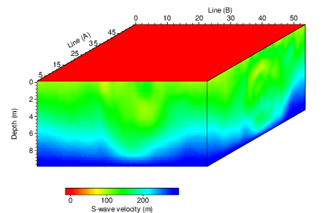

- [Main content](ch5_main.md)
- [Prev figure](ch5_fig09.md)
- [Next figure](ch5_fig11.md)

.
**Figure 11:** 3D view of the inverted subsurface S-wave velocities along Line A and Line B.
    

<span style="color:black"> **Source code used to reproduce Figure 11**: </span> <br>
<span style="color:blue"> *Dependency:* </span> [Seismic Unix](https://github.com/JohnWStockwellJr/SeisUnix). <br>
<span style="color:blue"> *Data availability:* </span> Input data is not yet available.


```sh
#/bin/bash
#
# a test on 3D cube plotting
# 20-11-2020, J. Liu

clip="perc=99"

dir=firstLine/par_1st_L9
data1=$dir/model_L5/modelTest_vs_stage_1.bin
data2=$dir/model_L5/modelTest_vs_stage_4.bin

rm -f temp/cube.bin
cat $data1 >> temp/cube.bin
cat $data2 >> temp/cube.bin

cmap="bhls=0.666666,.5,1 ghls=.3333,.5,1 whls=0,.5,1"
geometry="xbox=0 ybox=0 size1=3 size2=6 size3=4"

# make top face with zeros
sunull nt=215 ntr=215 | sustrip > null

# 3d ploting (Line B -> front; Line A -> side; Null -> top)
pscube < temp/cube.bin n1=40 n2=215 n3=215 angle=30 \
$geometry $cmap front=$data1 side=$data2 top=null faces=1 \
d1=0.25 f1=0.0 d1num=2 n1tic=5 label1="Depth (m)" \
d2=0.25 f2=0.0 d2num=10 n2tic=5 label2="Line (B)" \
d3=0.25 f3=0.0 d3num=10 f3num=5 n3tic=5 label3="Line (A)" \
legend=1 lstyle=horibottom lwidth=4 ly=-1 lx=1 \
units="S-wave velocity (m)" $clip > temp/cube_a.eps

geometry="xbox=0 ybox=0 size1=3 size2=6 size3=4"
pscubecontour < temp/cube.bin n1=40 n2=215 n3=215 angle=30 \
$geometry front=$data1 side=$data2 top=null faces=1 \
axescolor=white nlabelc=0 > temp/cube_b.eps

# merge into file
scale=0.5

x1=0.0; y1=0.0
psmerge translate=$x1,$y1 scale=$scale,$scale rotate=0. in=temp/cube_a.eps > figs/cube.eps 

#psmerge translate=$x1,$y1 scale=$scale,$scale rotate=0. in=temp/cube_b.eps \
#translate=$x1,$y1 scale=$scale,$scale rotate=0. in=temp/cube_a.eps > figs/cube.eps

open figs/cube.eps &

```

<a href="#top">Back to top</a>

