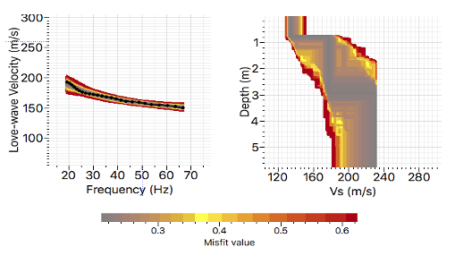
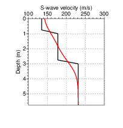

- [Main content](ch5_main.md)
- [Prev figure](ch5_fig05.md)
- [Next figure](ch5_fig08.md)

.

**Figure 6:** Results for 1D Neighborhood Algorithm (NA) inversion of picked dispersion data (blacked line in Figure 5c). (a) Comparison between picked dispersion curve of fundamental mode and the calculated dispersion curves from accepted models within misfit less than 1.0 (b) Invered S-wave velocity structure. Theoretical dispersion and corresponging S-wave velocity models are represented with misfit-based colors. 




**Figure 7:** Estimated 1D S-wave velocity structure ( black line) built from averaging parameters of the best 10 accepted models in Figure 6(b). Red line represents the smoothed version of the estimated structure (black line), which is then extended and used as the initial S-wave model for the sequential SH-FWI.


<span style="color:black"> **Source code used to reproduce Figure 7**: </span> <br>
<span style="color:blue"> *Dependency:* </span> [Seismic Unix](https://github.com/JohnWStockwellJr/SeisUnix). <br>
<span style="color:blue"> *Data availability:* </span> Input data is not yet available.


```sh
#!/bin/bash
#
# synthetic model, and its initial mode
# 24-11-2020, J.Liu 

WIDTH=4.5; HEIGHT=2.5
sizeX="wbox=$WIDTH hbox=$HEIGHT"

Colors="linecolor=black,red"
clip="perc=99"

data1=f_VS_profiles/fldr40_LN3.txt
data2=f_VS_profiles/fldr40_LN3_sig3.0.txt

rm -f temp/Vs_init
a2b < $data1 n1=$ny >> temp/Vs_init
a2b < $data2 n1=$ny >> temp/Vs_init

geometry="xbox=0 ybox=0 wbox=3.5 hbox=4.0"
# ploting horizontal slice
< temp/Vs_init psgraph n=24,24 pairs=2 \
d1=0.25,0.25 f1=0.0,0.0 n1tic=5 d1num=1 \
x2beg=100 x2end=300 n2tic=5 d2num=50 \
$Colors linewidth=2,2 \
grid1=dot grid2=dot \
$geometry labelsize=18 \
label1="Depth (m)" label2="S-wave velocity (m/s)" \
style=seismic title= > temp/fig07_a.eps

scale=0.5; dX=0.35; dY=0.35
# 1st row
x1=0; y1=0
x2=$(echo 2.5 $scale $dX| awk '{print $1 * $2 + $3}'); y2=$y1

# merge into one file
psmerge translate=$x1,$y1 scale=$scale,$scale in=temp/fig07_a.eps > temp/fig07.eps

open temp/fig07.eps &

```

<a href="#top">Back to top</a>

